# DockNotes 竞品拆解：Tucky

> 调研日期：2026-09-09  
> 目标：为 DockNotes 后续产品设计与 macOS 实现建立可追溯的功能基线。  
> 参考产品：Tucky 官网与本机 Tucky 1.0.13（build 15）。

DockNotes 的产品取舍与 MVP 需求见：[DockNotes MVP 产品需求](../../product/DOCKNOTES_MVP.md)。

## 1. 一句话定位

Tucky 是一个常驻 macOS 屏幕边缘的本地便签工具：便签平时缩成彩色标签，需要时从屏幕边缘展开；用户还可以在任何应用中呼出 AI 输入条，对便签、屏幕内容、日历和已连接应用执行查询或操作。

DockNotes 应优先复刻的不是“又一个 Markdown 编辑器”，而是这条核心体验链：

**随手记下 → 收回屏幕边缘 → 悬停快速找回 → 全局检索/询问 → 本地保存。**

## 2. 调研范围与证据等级

| 来源 | 本次是否访问 | 能确认的内容 | 证据等级 |
| --- | --- | --- | --- |
| [Tucky 官网](https://tucky.io/?ref=producthunt) | 是 | 定位、定价、平台要求、公开功能、连接器、快捷键 | 高 |
| 本机 Tucky.app 1.0.13 | 是，已完成实机检查 | Edge Deck、便签编辑器、日期选择、资料库、归档、导出菜单、设置、Plus 订阅墙 | 高 |
| Tucky onboarding 图片与视频 | 是 | 边缘卡片组、休眠态、全局 Ask、按住说话流程 | 高 |
| [Product Hunt 产品页](https://www.producthunt.com/products/tucky) | 是，已检查两页评论 | 发布数据、定位、用户关注点、价格质疑、平台需求 | 中（评论样本少，且部分被标记为 Likely AI） |

说明：下文用“已验证”表示官网、应用元数据或应用内官方资源直接支持；“推断”表示根据静态资源或二进制中的用户可见文案归纳，后续仍需在可运行版本中复测。

## 3. 核心界面与状态

### 3.1 屏幕边缘卡片组（Edge Deck）

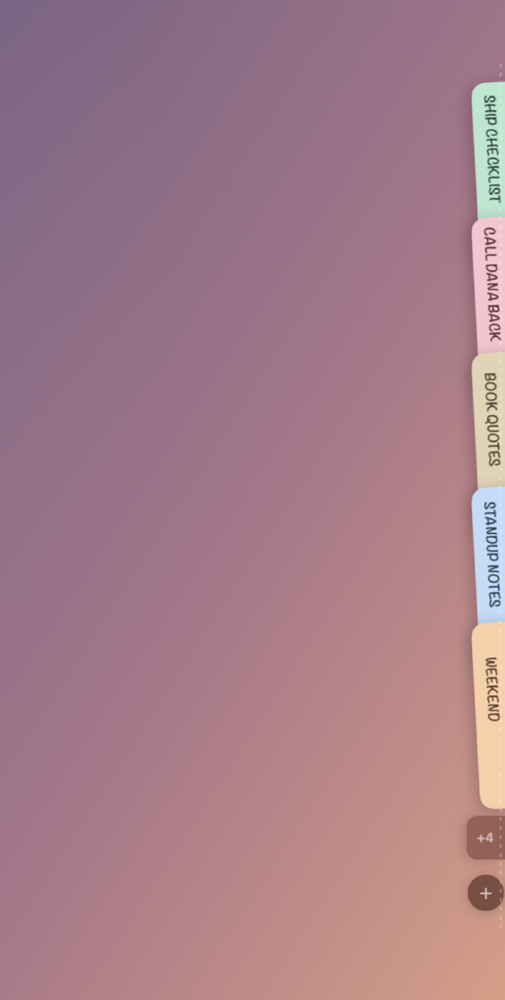

已验证：

- 多张便签以不同颜色的纵向标签吸附在屏幕边缘，标签显示标题。
- 卡片有堆叠/扇出效果，传达“便签藏在屏幕外”的空间关系。
- 边缘底部有新增按钮；当便签较多时使用 `+N` 汇总未展示项目。
- 可以把边缘胶囊拖到任意显示器、左右边缘和不同垂直位置。
- 支持悬停标签时打开便签，也提供“Show preview on hover”设置。
- 支持固定便签，使其保持打开。
- 支持在全屏应用上方显示。
- 标签本身不带类别图标；纵向文字就是对应便签标题，一张标签对应一张便签。
- 展开当前便签后，它的标签从 Edge Deck 移到编辑器左侧成为书脊，其余标签仍留在屏幕边缘。
- `Close` 只把当前编辑器收回该便签自己的标签，不代表折叠一个大分类侧栏。

### 3.2 休眠态（Rest State）


已验证：

- 闲置时只留下极窄的彩色边缘提示，最大限度减少遮挡。
- 颜色同时承担便签身份、快速定位和视觉装饰三种职责。
- 用户需要先理解“靠近屏幕边缘”的发现方式；首次引导非常重要。

### 3.3 全局 Ask Bar

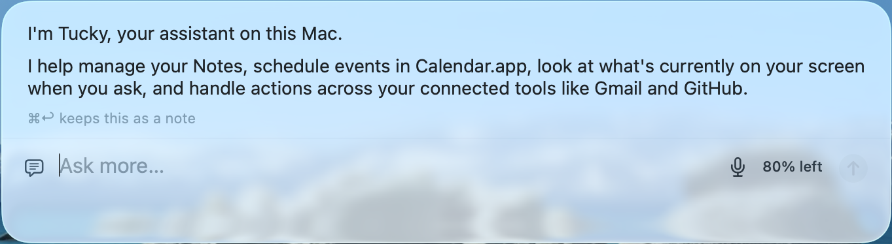

已验证：

- `⌥ Space` 可从任意应用呼出一个浮动、半透明的 AI 输入条。
- 输入条支持键盘输入、麦克风入口、剩余用量显示和发送按钮。
- AI 回复在同一个浮层内逐步展开，不要求切换到独立聊天窗口。
- `⌘ Return` 可把当前内容保留为便签。
- 首次消息只发送便签标题；只有用户允许读取或在便签内按 `⌘ J` 时，正文才会交给 AI。

### 3.4 全局 Ask 流程

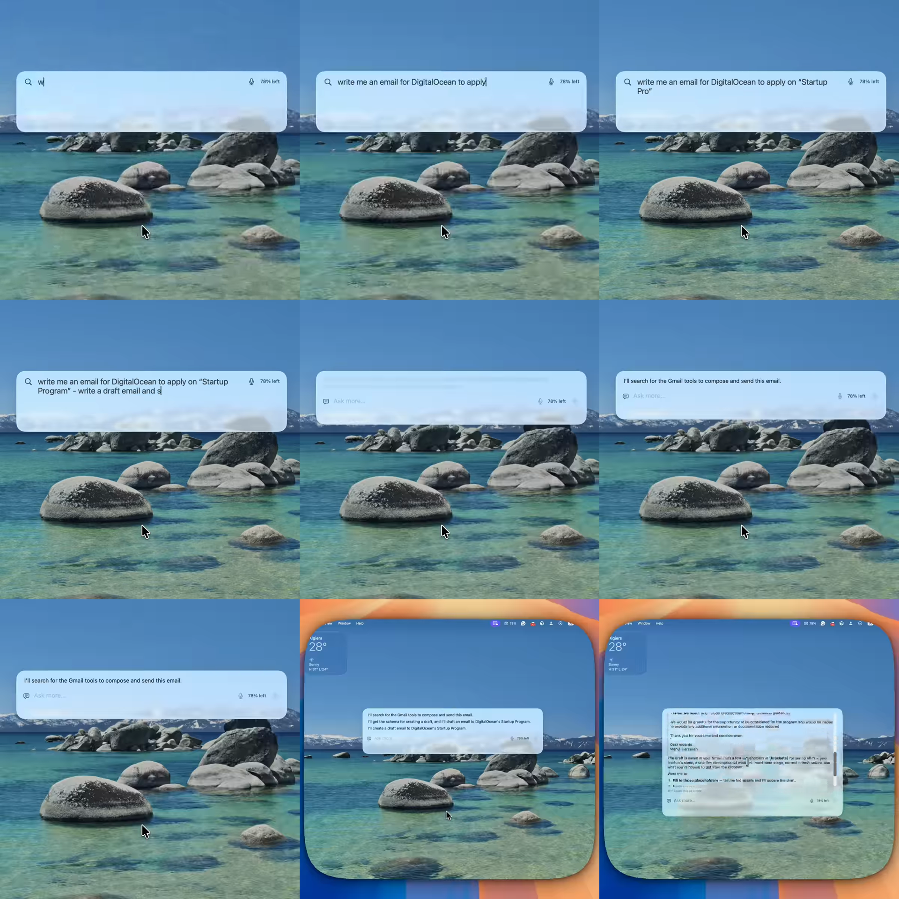

官方 onboarding 演示的流程：

1. 在桌面按 `⌥ Space` 呼出输入条。
2. 输入任务，例如生成一封申请邮件。
3. AI 说明即将查询 Gmail 工具并生成草稿。
4. 浮层扩展为可滚动答案区，继续保留“Ask more”输入。
5. 对外发送或修改第三方内容应在 DockNotes 中加入明确的确认步骤。

### 3.5 按住说话

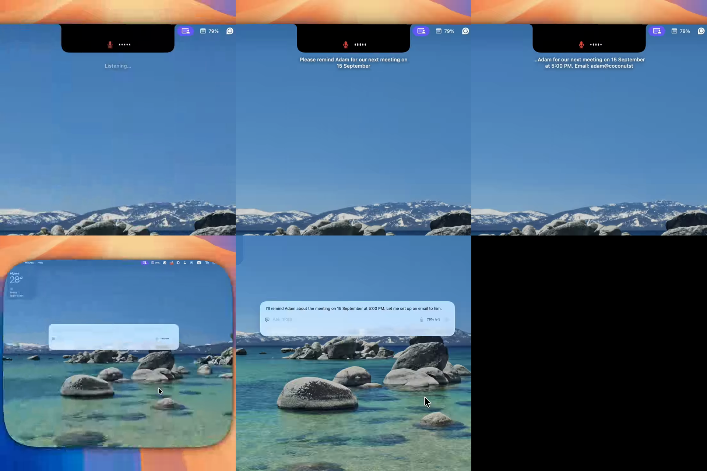

已验证：

- 按住 `⌃⌥` 开始说话，松开结束。
- 刘海/菜单栏下方显示监听胶囊、实时转写与状态反馈。
- 语音可转成提醒或后续 AI 操作；官网称支持 60+ 语言。
- 麦克风与语音识别分别使用 macOS 权限。

### 3.6 实机便签编辑器

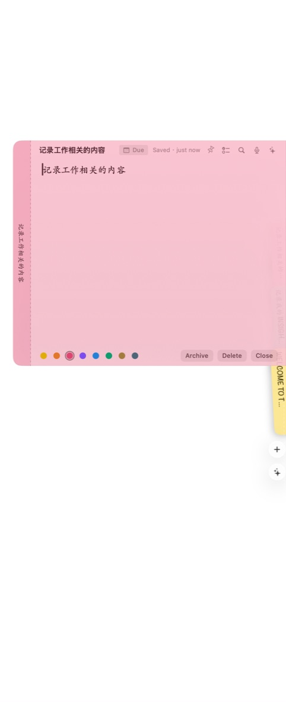

已验证：

- 编辑器直接从边缘标签向屏幕内部展开，标签仍留在左侧作为来源提示。
- 顶栏依次提供日期、保存状态、固定、任务、查找、语音和 AI。
- 底部提供 8 种颜色：Lemon、Peach、Rose、Lilac、Sky、Mint、Sand、Slate。
- Archive、Delete、Close 集中在右下角；正文区域保持极简。
- 右键菜单包括 Pin、Hide from AI、Archive、Cycle colour、Read aloud、Delete。
- `Due` 使用原生日期选择器；资料库还可以用 `Due first` 优先排列到期便签。

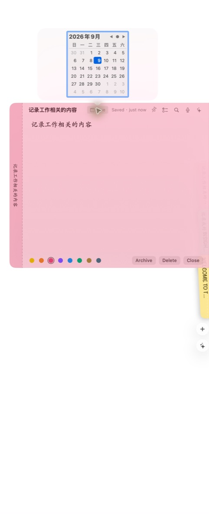

### 3.7 资料库与归档

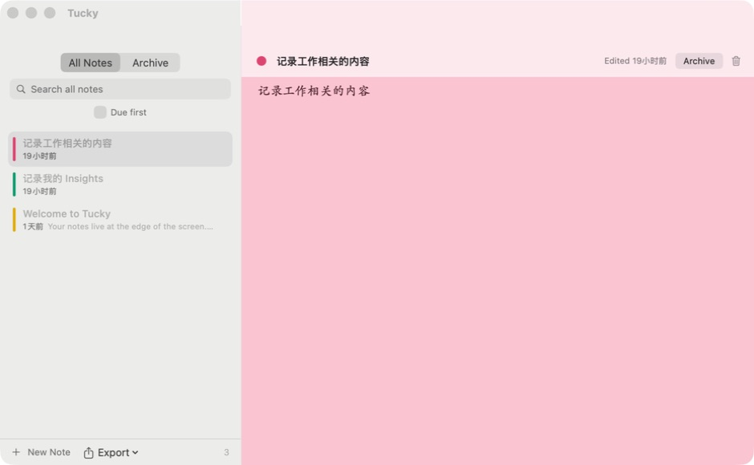

已验证：

- 独立资料库采用左侧列表、右侧编辑器的双栏结构。
- 顶部切换 All Notes / Archive，左侧提供全文搜索和 Due first。
- 列表项显示颜色、标题、修改时间和正文摘要。
- 右侧可以直接编辑、改色、归档或删除。
- 底部显示 New Note、Export 和当前列表数量。
- Archive 空状态同时在列表区显示 `Nothing archived`，在内容区显示 `Select a note`。


### 3.8 设置结构

设置包含六个一级页签：Shortcuts、Deck、Notes、Connectors、AI、Updates。

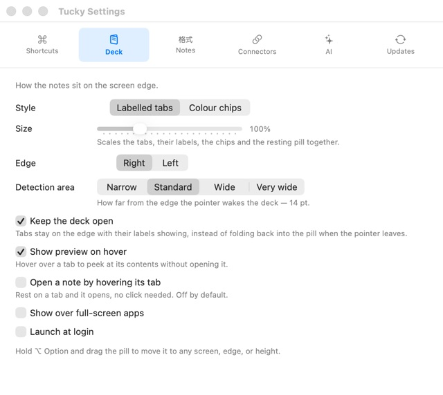

- Deck 样式可以选择 `Labelled tabs` 或 `Colour chips`。
- Deck 整体尺寸可缩放；唤醒范围有 Narrow / Standard / Wide / Very wide 四档，Standard 为 14pt。
- 可以选择左右边缘、保持展开、悬停预览、悬停直接打开、覆盖全屏应用和开机启动。

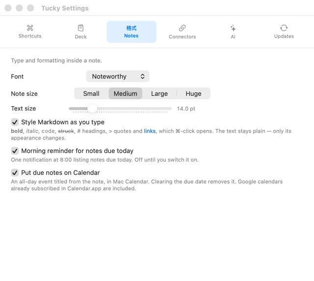

- 字体可选；实机当前为 Noteworthy。
- 便签尺寸分 Small / Medium / Large / Huge，正文字号用滑杆独立调整。
- Markdown 只是视觉样式，底层文本保持纯文本。
- 到期提醒在每天 8:00 汇总；可把到期便签映射为 Mac Calendar 全天事件。

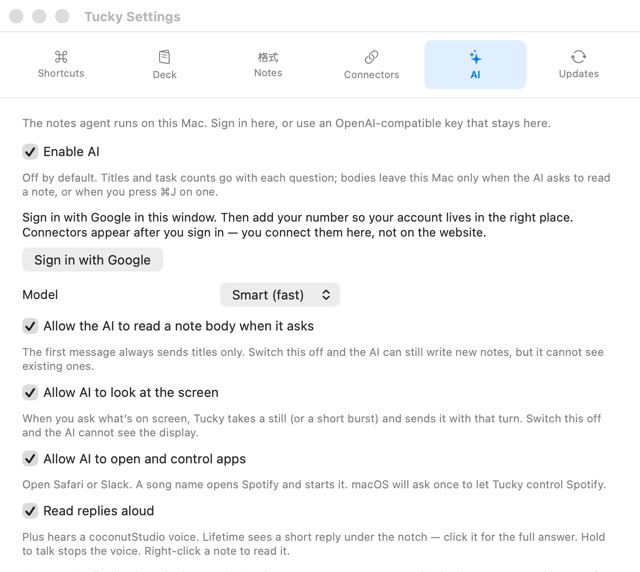

- AI、正文读取、屏幕查看、应用控制和朗读回复均为独立开关。
- 屏幕查看只在用户发起相关问题时捕获静态图或短 burst，并随该轮请求发送。
- 设置页声称支持本地保存的 OpenAI-compatible key；本次界面未出现可填写的 BYOK 字段。
- Connectors 页在未登录时仅显示 Google 登录按钮，没有提前列出连接器权限明细。

## 4. 完整功能清单

### 4.1 便签与编辑

- 创建、打开、关闭、重命名、删除便签。
- 归档便签，以及查看 All Notes / Archive。
- 固定/取消固定便签。
- 搜索全部便签。
- 多种便签颜色；快捷循环颜色，也可右键选择。
- 字体、字号、便签尺寸、边缘宽度等外观设置。
- 纯文本编辑，实时渲染 Markdown 外观。
- Markdown 至少包括：粗体、斜体、行内代码、删除线、1–6 级标题、引用、链接。
- `⌘` 点击 Markdown 链接后打开。
- Checkbox tasks / 待办复选框。
- 截止日期、今日到期提示、按到期时间排序。
- 删除后提供 10 秒撤销窗口。

### 4.2 边缘与窗口行为

- 左/右屏幕边缘吸附。
- 可移动到多显示器与不同高度。
- 便签组扇出、折叠、悬停预览。
- 便签编辑器以浮层方式打开，其他便签继续留在边缘。
- 可覆盖全屏应用。
- 菜单栏代理应用（`LSUIElement = true`），不占常规 Dock 图标位置。
- 支持开机启动（从内置设置文案推断）。

### 4.3 快捷键

| 快捷键 | 动作 | 状态 |
| --- | --- | --- |
| `⌥⌘N` | 新建便签 | 已验证 |
| `⌥⌘A` | 打开 All Notes | 已验证 |
| `⌥⌘L` | 打开 Archive | 已验证 |
| `⇧⌘Space` | Quick capture | 实机设置已验证；自动化快捷键未成功呼出 |
| `⌥ Space` | 从任意应用打开 Ask Bar | 已验证 |
| `⌃⌥`（按住） | 语音输入，松开结束 | 已验证 |
| `Esc` | 关闭当前便签 | 已验证 |
| `⌘F` | 在当前便签中查找 | 已验证 |
| `⌘J` | 针对当前便签询问 AI | 已验证 |
| `⌘T` | 将当前段落切换为任务 | 已验证 |
| `⌘P` | 固定当前便签 | 已验证 |
| `⌘.` | 循环切换便签颜色 | 已验证 |
| `⌘⌫` | 删除便签，可在 10 秒内撤销 | 已验证 |
| `⇧⌘A` | 归档当前便签 | 已验证 |
| `⌃=` / `⌃-` | 放大 / 缩小正文 | 已验证 |
| `⌘ Return` | 将 Ask Bar 内容保留为便签 | 已验证 |

### 4.4 AI 能力

- 从任何应用呼出 AI。
- 写作、改写和编辑便签。
- 跨便签查询；首轮只发送标题，正文读取需要授权。
- 可为单张便签设置 `hidden_from_ai`。
- 选择模型；官网宣称多个推理模型已内置。
- AI 可查看当前屏幕，但需要 Screen Recording 权限和设置开关。
- AI 可打开指定应用，并控制 Spotify / Apple Music 等有限目标，但需要自动化权限。
- 支持朗读回复与短回复胶囊。
- 应用内文案提到 OpenAI-compatible 本地密钥，但实机未显示配置字段；Product Hunt 上 maker 又称 BYOK 仍在考虑，当前是否可用存在证据冲突。
- 有剩余 AI 用量/points 展示。

### 4.5 日历、提醒与连接器

- 读取 Calendar.app 今日/明日事件。
- 用户确认后创建日历会议。
- 便签到期日可镜像到本地 Calendar.app。
- 到期日当天早晨发送本地通知。
- Plus 公开连接器：Gmail、Google Calendar、Google Docs、Google Sheets、GitHub、Notion。
- 连接器需要 Google 登录与 Tucky 账户；应用内完成连接管理。
- 未登录状态下，Connectors 页面只显示 `Sign in with Google`，没有展示逐项 OAuth 权限范围。

### 4.6 导出与迁移

- Markdown：每张便签一个文件。
- Plain text：每张便签一个文件。
- Single document：合并为单一文档。
- Apple Stickies archive (`.stickies`) 导出。
- 支持从同一菜单 Import。
- 官网称“Exports clean”，适合把无锁定导出作为 DockNotes 的核心原则。

### 4.7 更新与商业边界

- 免费版：最多 5 张本地加密便签；无 AI、语音和连接器。
- Plus：$4/月；无限便签、AI、语音、连接器。
- 官网版本 1.0.13；macOS 15+；Apple silicon 与 Intel；约 15 MB。
- 本机已升级到 1.0.13（build 15）并完成实机检查。
- 免费账号点击 AI 后直接显示 Plus 订阅墙：$4/月、无限便签、Hosted AI、60+ 语言语音，付款方式显示 PayPal。
- Sparkle 负责更新；应用每天检查一次 appcast，并使用内置 EdDSA 公钥验证签名。

## 5. 数据模型与隐私基线

Tucky 明确采用本地优先设计：

- SQLite 数据库，WAL 模式。
- 便签正文使用 AES-GCM 加密；数据库中的 `body` 是 BLOB。
- 官网和应用内文案均声明便签默认只保留在 Mac 上。
- 用户打开 AI 后才会与 coconutStudio 通信。
- AI 首条请求只发送标题；读取正文需单独允许。
- 屏幕查看、麦克风、语音识别、日历、通知和应用控制均使用 macOS 权限。

从本机 1.0.12 可验证的便签字段：

```text
id
title
body
color
created
modified
archived
sort_order
pinned
hidden_from_ai
due_on
calendar_event_id
google_event_id
```

DockNotes 建议额外增加：

```text
schema_version
deleted_at
last_opened_at
window_state
edge_position
content_format_version
encryption_key_version
```

## 6. 信息架构建议

```text
DockNotes
├── Edge Deck
│   ├── Rest indicator
│   ├── Note tabs
│   ├── Overflow count
│   └── New note
├── Note Editor
│   ├── Title / body
│   ├── Live Markdown
│   ├── Tasks / due date
│   ├── Color / pin
│   └── Note-scoped AI
├── Library
│   ├── All Notes
│   ├── Search
│   └── Archive
├── Global Ask
│   ├── Text
│   ├── Voice
│   ├── Screen context
│   └── Tool actions
└── Settings
    ├── General
    ├── Appearance
    ├── Shortcuts
    ├── AI & privacy
    ├── Connectors
    └── Export
```

## 7. UX / 视觉审计

### 优点

- **入口快**：全局快捷键和屏幕边缘都能直接进入核心任务。
- **空间隐喻强**：卡片“藏在屏幕外”很容易建立肌肉记忆。
- **干扰低**：休眠态仅保留少量彩色像素，适合长期常驻。
- **渐进披露**：平时是标签，悬停后扇出，点击后才显示完整编辑器。
- **本地信任感明确**：本地、加密、AI 读取授权被写进产品文案与数据设计。
- **AI 不抢主角**：AI 是贴在便签旁的能力，而不是把用户带去聊天应用。

### UX 风险

- **发现性不足**：第一次使用者可能不知道边缘色条可以悬停或点击。
- **边缘冲突**：可能与 macOS 热角、Stage Manager、隐藏 Dock、窗口缩放手势冲突。
- **多显示器复杂**：显示器断开、分辨率变化、全屏 Space 切换时，需要稳定恢复位置。
- **标签拥挤**：标题较长、便签过多或同色便签较多时，识别效率下降。
- **隐式 AI 权限难理解**：标题、正文、屏幕内容和第三方工具是四种不同的数据边界，必须分别说明。
- **强制更新阻断任务**：1.0.12 必须升级后才能继续使用；即使数据完全本地，旧版本也无法临时读取或导出便签。
- **订阅价值难试用**：免费用户点击 AI 直接看到 Plus 订阅墙，无法在购买前体验一次真实 AI 或语音流程。
- **权限说明分散**：AI 设置解释了数据边界，但 Connectors 登录前没有展示各服务会申请哪些权限。

### 可访问性风险

- 纵向旋转标题与窄标签可能降低可读性。
- 仅靠颜色区分便签对色觉障碍用户不够友好，应保留标题、图标或形状编码。
- 极窄休眠热区可能不满足舒适的指针目标尺寸。
- 悬停作为主要入口对键盘用户和部分辅助技术不友好，需提供完整快捷键与菜单替代。
- 半透明材质在复杂桌面背景上可能产生对比度不足。
- 扇出、滑入和缩回动画应遵守“减少动态效果”系统设置。
- 截图无法验证 VoiceOver 朗读顺序、焦点环、键盘遍历、缩放和实际对比度；实现后必须专项测试。

### Product Hunt 反馈信号

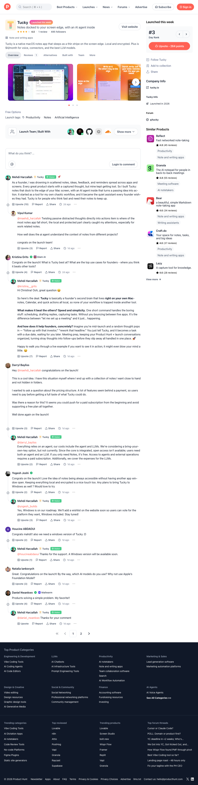

调研时页面显示：2026 年发布、当日榜第 3、264 points、495 followers、4.0 分但只有 1 条正式 review。这些数字只代表发布初期快照，不适合当作长期产品质量指标。

两页评论反复出现的正向信号：

- 用户认可“便签贴在边缘、不再打开另一个窗口”的低切换成本。
- 本地加密与随手捕获是最容易理解的差异点。
- “把一闪而过的想法直接变成任务和到期日”比泛化 AI 聊天更有吸引力。
- Founder 场景集中在跟进、会议准备、发布期间的零碎任务和快速回复草稿。

评论暴露的未解决问题：

- AI 如何区分不同项目的上下文，避免跨项目污染。
- 何时读取正文、哪些数据会交给模型、使用哪些模型。
- 免费版无法充分体验 AI，而 Plus 的多数价值都依赖 AI 成本。
- 多位用户询问 Windows；maker 表示已在路线图中。
- Product Hunt 中 maker 表示 BYOK “正在考虑、目前没有”，与应用内 OpenAI-compatible 文案冲突，需要以后复测。

证据限制：评论样本很小，部分评论被 Product Hunt 标记为 `Likely AI`，maker 的回答也属于产品方陈述，因此只作为需求信号，不当作独立用户验证。

## 8. DockNotes 分期建议

### MVP：先把“边缘便签”做对

1. macOS 菜单栏代理应用。
2. 右侧边缘 Rest indicator 与卡片扇出。
3. 新建、编辑、删除、撤销、归档、搜索。
4. 颜色、固定、排序。
5. Live Markdown 与 checkbox tasks。
6. SQLite 本地存储与正文加密。
7. 全局快捷键与多显示器位置恢复。
8. Markdown / 纯文本导出。

### P1：日常效率

1. 到期日期、今日筛选与本地通知。
2. Calendar.app 可选镜像。
3. All Notes / Archive 完整资料库。
4. 自定义快捷键、字体、尺寸、左右边缘。
5. 全屏覆盖、减少动态效果、VoiceOver 与键盘导航。

### P2：可选 AI

1. 全局 Ask Bar。
2. 单张便签 AI 与跨便签检索。
3. “标题可见 / 正文需授权 / 完全隐藏”三级隐私边界。
4. OpenAI-compatible BYOK，密钥存 Keychain。
5. 屏幕理解与语音输入，分别申请权限。
6. 工具动作预览与执行前确认。

### P3：连接器

优先从只读连接器开始，再加入写操作：

1. Calendar / GitHub 只读查询。
2. Gmail 草稿创建，不直接发送。
3. Notion / Docs 导出。
4. 经用户确认后的日历创建或第三方写操作。

## 9. 技术实现方向（初步）

- 原生栈：Swift + SwiftUI + AppKit；使用无标题浮动 `NSPanel` 处理边缘窗口和 Ask Bar。
- 应用形态：`LSUIElement` 菜单栏代理应用。
- 存储：SQLite + WAL；正文单独加密，密钥存 Keychain，并预留密钥轮换版本。
- 编辑：底层保持纯文本，Markdown 只影响呈现，确保无锁定导出。
- 快捷键：全局快捷键冲突检测与可重映射。
- 屏幕管理：按 `NSScreen` 稳定标识保存边缘、纵向比例和展开状态。
- 更新：Sparkle 可选，但 DockNotes 不应使用强制更新阻断本地便签访问。
- AI：把模型、上下文授权、工具权限和执行确认拆成独立模块。

## 10. 复刻边界

DockNotes 可以复刻交互思想与用户价值，但不应复制 Tucky 的名称、图标、文案、字体文件、截图素材或逐像素视觉。建议保留以下原创空间：

- 自己的品牌、图标与配色系统。
- 不同于 Tucky 的卡片形态与动效节奏。
- 更清晰的隐私控制和连接器执行确认。
- 免费、本地优先的基础功能，不人为限制本地便签数量。
- 更稳健的离线模式和非阻断式更新。

## 11. 当前证据限制与待验证问题

- 已进入 1.0.13 的编辑器、资料库、归档、设置与订阅墙；未登录或购买 Plus。
- 未验证拖拽排序、卡片最大数量、长标题截断、Colour chips 实际形态和多显示器位置恢复。
- 未验证 Markdown 编辑时的光标稳定性、粘贴行为和大型便签性能。
- 未验证离线启动、数据库恢复、密钥丢失和导入流程。
- 未验证 AI 工具写操作是否始终二次确认。
- 未验证各连接器具体权限范围与撤销流程。
- 未验证 Quick capture 快捷键的实际界面；自动化按键未成功呼出。
- 未验证 BYOK，当前存在应用文案与 maker 评论互相矛盾的证据。
- 未验证 VoiceOver、键盘焦点、减少动态效果和高对比度模式。
- 为避免改动用户数据，本轮未创建、删除、归档、改色或改写真实便签，也没有执行导出。

## 12. 本轮截图索引

1. `screenshots/01-tucky-homepage.png` — 官网完整页面（部分延迟加载的媒体区域为空白）。
2. `screenshots/02-product-hunt.png` — Product Hunt 首页与第一页评论。
3. `screenshots/03-edge-deck.png` — 官方 onboarding 的边缘卡片组。
4. `screenshots/04-ask-bar.png` — 官方 onboarding 的 Ask Bar。
5. `screenshots/05-rest-state.png` — 官方 onboarding 的休眠态。
6. `screenshots/06-onboarding-icon.png` — 官方 onboarding 图标，仅作为竞品证据，不用于 DockNotes。
7. `screenshots/07-ask-flow-contact-sheet.png` — Ask 视频关键帧。
8. `screenshots/08-voice-flow-contact-sheet.png` — 语音视频关键帧。
9. `screenshots/09-product-hunt-comments-page-2.png` — Product Hunt 第二页评论。
10. `screenshots/10-live-edge-deck.png` — Tucky 1.0.13 实机 Edge Deck。
11. `screenshots/11-live-note-editor.png` — 实机便签编辑器。
12. `screenshots/12-live-note-due-picker.png` — 原生到期日期选择器。
13. `screenshots/13-live-settings-shortcuts.png` — 快捷键设置。
14. `screenshots/14-live-settings-deck.png` — Deck 设置。
15. `screenshots/15-live-settings-notes.png` — 编辑与提醒设置。
16. `screenshots/16-live-settings-connectors.png` — 未登录的连接器设置。
17. `screenshots/17-live-settings-ai-top.png` — AI 与隐私设置。
18. `screenshots/18-live-settings-ai-bottom.png` — AI 设置下半部分。
19. `screenshots/19-live-settings-updates.png` — 1.0.13 更新策略。
20. `screenshots/20-live-library-all-notes.png` — All Notes 双栏资料库。
21. `screenshots/22-live-library-archive-empty.png` — Archive 空状态。
22. `screenshots/23-live-plus-paywall.png` — 免费账号的 Plus 订阅墙。
